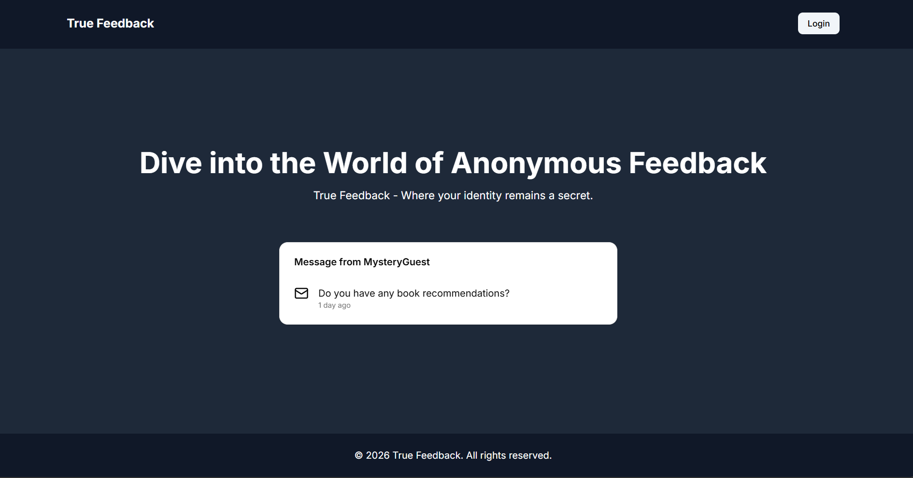
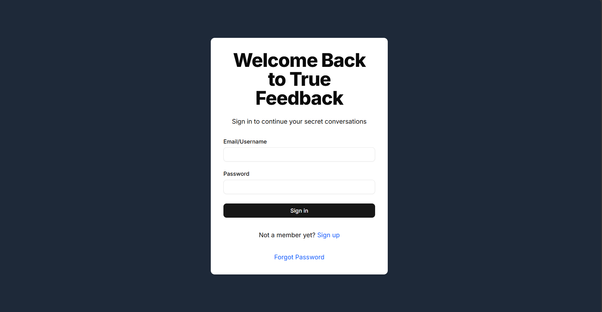
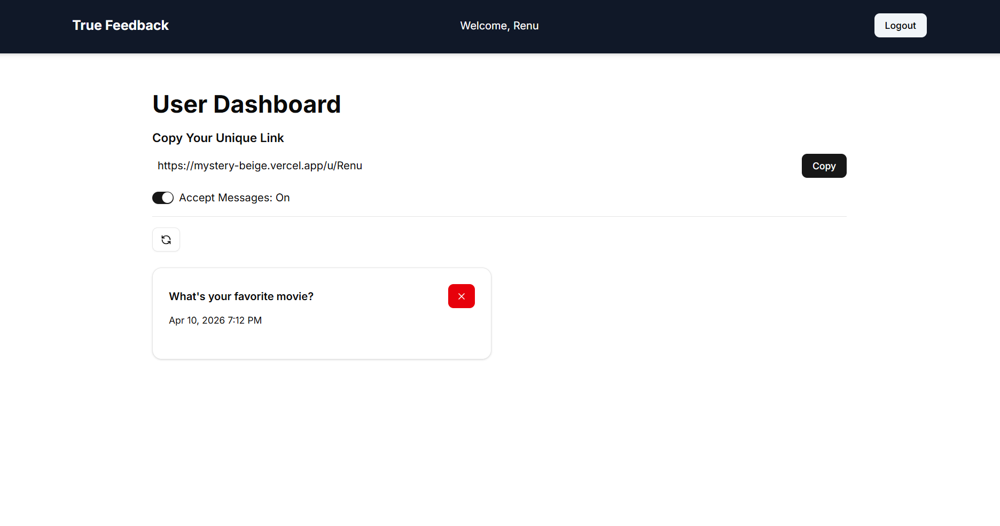

# Anonymous Messaging Platform

A production-ready full-stack application that enables users to receive anonymous messages through a unique public profile URL.

🔗 [Live Demo](https://mystery-beige.vercel.app)

## Screenshots

### Landing Page


### Sign In Page


### Sign Up Page


### Anonymous Message Page


### Dashboard


## Core Features
- Stateless JWT-based authentication and protected routes using NextAuth Credentials Provider
- Email verification with OTP and expiry handling
- Password recovery and reset workflow
- Public route for anonymous message submission
- Protected dashboard for viewing and deleting messages
- Toggle to enable/disable incoming messages
- AI-powered message suggestion integration
- Fully responsive UI and Dockerized deployment

## Tech Stack
- Next.js 15 App Router
- TypeScript
- MongoDB + Mongoose
- NextAuth Credentials Provider
- Tailwind CSS + shadcn/ui
- React Hook Form + Zod
- Nodemailer
- Docker

## Architecture
- Stateless JWT authentication using NextAuth with custom `jwt` and `session` callbacks
- RESTful API routes implemented under `/api/*`
- Zod-based schema validation on both client and server
- MongoDB user model with embedded anonymous message subdocuments
- Reusable component-driven frontend architecture using shadcn/ui

## AI Integration Suggestion
- Uses Gemini API to generate anonymous message suggestions for users who need inspiration before sending a message.

## Key API Routes

| Route | Description |
|-------|-------------|
| `/api/sign-up` | Register user and send verification code |
| `/api/send-message` | Persist anonymous message to database |
| `/api/get-messages` | Fetch authenticated user's messages |
| `/api/delete-message/[messageId]` | Delete selected message |
| `/api/accept-messages` | Update message acceptance state |

## Local Setup

```bash
git clone <repo-link>
cd mystery
npm install
npm run dev
```

## Environment Variables

```env
MONGODB_URI=
NEXTAUTH_SECRET=
NEXTAUTH_URL=
EMAIL_USER=
EMAIL_PASS=
GEMINI_API_KEY=
```

## Future Enhancements

- WebSocket-based real-time messaging
- Rate limiting and spam prevention
- User analytics and profile customization
- Dark mode and notification system
